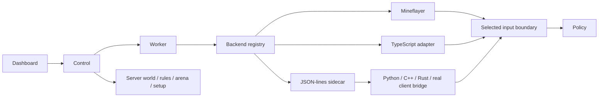

# Replaceable agent backends

The default is **Mineflayer on the existing shared Minecraft server**. Backend
selection is independent of your policy/trainer, observation profile, experiment
stage, world/rules/inventory setup, dashboard, logging and run lifecycle.

The built-in **Fabric RGB** backend runs an actual 1.18.1 game client with a live
dashboard camera. See [Fabric client setup](fabric-clients.md) for preparation,
resource limits and supported inputs.



## Switching

Choose **Agent backend** in the new-run dialog. It lists installed/registered
implementations compatible with the selected environment mode. Coverage details
distinguish native, approximate, externally supplied and unsupported channels.
Backend changes apply to new runs; an active run keeps its backend.

`MC_AGENT_BACKEND=mineflayer` sets the default for new Minecraft runs. Simulator
runs default to `simulator`. API clients may send `backend` in `POST /runs`.
Run configuration and downloaded `config.json` record the selected descriptor and
revision. Reruns preserve the recorded backend ID and reject a changed revision.
Legacy runs without a backend retain their historical Mineflayer/simulator default.

Configure additional adapters through a trusted JSON manifest:

```dotenv
AGENT_BACKENDS_FILE=examples/backends/backends.example.json
```

Then restart control using your normal development command. The supplied manifest
adds two **runnable simulator examples**, one module and one process. Choose
Simulator mode to use them. They demonstrate switching and lifecycle behavior;
they do not implement Botcraft, CraftGround or a rendered Minecraft client.

Use this manifest as a template for installed clients. Relative module and working
directory paths resolve against the manifest's directory. Relative executable paths
resolve against the specified working directory; bare commands use PATH. All
argument strings are passed directly with `shell: false`. Keep credentials in
private local profiles or explicitly mapped environment values. The public backend
catalog contains descriptors and revisions, never commands, environment values or
module paths. Dashboard/API users select registered IDs; they cannot submit an
arbitrary executable or module path through a training run.

`GET /backends` requires control authentication and is available through the
same-origin dashboard proxy. Registry changes require a control restart so workers
and the queue use the same configuration snapshot. A configuration/source mismatch
at worker startup fails the run instead of changing its backend silently.

## Stable extension boundary

The SDK entry point is `@rlcraft/agents/backends`. A TypeScript module exports:

```ts
import type { BackendContext } from "@rlcraft/agents/backends";
import type { Environment } from "@rlcraft/core";

export function createEnvironment(context: BackendContext): Environment {
  // Return your adapter around a game client, local process or remote service.
  // The runnable simulator-module.ts example shows a complete factory.
  return new YourClientEnvironment(context);
}
```

The manifest owns its descriptor; the factory owns the implementation. Declare the
actual supported Minecraft versions, actions, input channels and lifecycle
operations. A missing channel entry means unsupported. `"*"` means validation is
delegated to the backend; Mineflayer itself checks protocol compatibility when it
connects. Capabilities are adapter declarations, not hardware benchmarks or automatic
proof of visual/audio fidelity.

`BackendContext` supplies run ID, assigned username, connection settings, immutable
input selection, asset directory and managed setup/arena callbacks. The core
`Environment` contract contains:

| Method               | Responsibility                                                                  |
| -------------------- | ------------------------------------------------------------------------------- |
| `connect()`          | Create/attach to exactly this assigned player session; complete spawn handshake |
| `observe(tick)`      | Return core `Observation` including `AgentInputFrame`; sync or async            |
| `apply(action)`      | Apply current held controls/look/dig; an empty action must release controls     |
| `reset(setup)`       | Respawn/release, request managed setup and wait for client synchronization      |
| `respawn()`          | Recover a dead player before the next generation                                |
| `teleport(position)` | Request managed arena placement and verify client synchronization               |
| `capture(frame)`     | Optional externally supplied media, when genuinely supported                    |
| `close()`            | Release controls, disconnect and close only resources owned by this adapter     |

Managed Minecraft runs require reset and respawn; arenas additionally require
teleport. Missing implementations of declared lifecycle capabilities are rejected.
Unsupported nonempty policy actions fail explicitly. The simulator only implements
its small documented subset; selecting another backend does not expand the current
core action contract automatically.

All policy/trainer inputs pass through the common selection boundary, even if an
adapter returns extra channels or fields. Missing selected channels report
`unavailable`, with a reason, rather than invented values. Policy code continues to
read `{ tick, inputs }`; internal health/position/inventory bookkeeping is separate.

An adapter must itself enforce **player-visible provenance**. The boundary filters
channel/field selections, but cannot prove that an external implementation sourced
a value from the correct player or avoided privileged world reads. Never give a
policy the server setup callbacks, control token, shell execution, arbitrary
commands or unrestricted reflection. Local adapters are trusted runtime code.

## External-process protocol

The JSON-lines sidecar allows clients written in Python, C++, Rust or Java to reuse
the control service. It is a transport implementation; a bridge translating another
framework's observations/actions is still required.

One process belongs to one assigned agent. stdin/stdout use UTF-8 JSON, one object
per line. Each request is:

```json
{ "protocol": 1, "id": 1, "method": "observe", "params": { "tick": 12 } }
```

Each response must match the numeric ID:

```json
{
  "protocol": 1,
  "id": 1,
  "result": {
    "position": { "x": 0, "y": 64, "z": 0 },
    "health": 20,
    "food": 20,
    "inventory": {},
    "tick": 12,
    "inputs": {
      "schemaVersion": 1,
      "at": 1790613000000,
      "tick": 12,
      "sequence": 12,
      "channels": {},
      "diagnostics": { "droppedEvents": 0, "droppedBytes": 0, "eventBytes": 0 }
    }
  }
}
```

The timestamp above is illustrative: generate `at` from the current UTC epoch
milliseconds. A frame more than five seconds old or 250ms in the future is rejected.
Channel sample timestamps may reflect their configured sampling cadence. Binary
media uses the existing base64 RGB/PCM observation formats, with capture dimensions,
encoding and source declared honestly. Unknown channels are filtered; malformed
frame/state/sample schemas are rejected before reaching the learner.

Failures use `{"protocol":1,"id":1,"error":"descriptive reason"}`. There are no
unsolicited stdout messages. Keep diagnostic logs on stderr or in producer-owned
log files; stdout is exclusively RPC. stderr is drained, not forwarded to public
control logs.

| Request    | Parameters / required behavior                                                                                                                                                                     |
| ---------- | -------------------------------------------------------------------------------------------------------------------------------------------------------------------------------------------------- |
| `connect`  | `{mode, runId, username, connection, inputs}`; spawn/attach and acknowledge readiness                                                                                                              |
| `observe`  | `{tick}`; return core observation schema, preserving event sequences                                                                                                                               |
| `apply`    | `{action}`; acknowledge after input application                                                                                                                                                    |
| `respawn`  | `{}`; acknowledge after respawn synchronization                                                                                                                                                    |
| `reset`    | Minecraft: `{phase:"before", setup}` to release/respawn, then `{phase:"after", setup}` to synchronize after the control service applies setup. Simulator: one `{phase:"simulator", setup}` request |
| `teleport` | `{position}`; acknowledge client synchronization after managed placement                                                                                                                           |
| `capture`  | `{frame}`; accept only if declared and implemented                                                                                                                                                 |
| `close`    | `{}`; release/disconnect, acknowledge and exit                                                                                                                                                     |

Requests are correlated by ID, with at most 16 outstanding. Default request timeout
is five seconds and default message limit is 4MiB. Both are configurable within
bounds. Workers also impose component deadlines, so a transport timeout longer than
a worker deadline does not extend that operation. Malformed envelopes, oversized
messages, unexpected IDs, process exit or timeouts fail the session. Graceful close
is bounded, followed by termination of the owned sidecar process.

Producers **must exit on stdin EOF and clean up their own child processes**, as well
as implement close. This is necessary when a worker crashes or is forcibly killed;
the bridge cannot guarantee cleanup of arbitrary grandchildren. A supervised client
service with leases is an alternative. Parent control/Firebase credentials are not
inherited: a small OS environment allowlist and explicitly configured values are
passed to the process. Python environments may need explicit executable paths and
library/GPU environment values in their profiles.

JSON/base64 is practical for the first adapter and small observations. It adds
copies and encoding overhead for high-rate large frames. A future shared-memory,
binary/gRPC or service adapter can implement the same async Environment boundary;
this change does not implement those transports or distributed run-worker placement.

## Reproducibility and cloud placement

The revision fingerprints the descriptor/profile and entry-module source (or the
built-in implementation). It is a configuration identity, not a complete build
attestation. External binaries and transitive custom-module imports must be pinned
through the adapter's version, immutable artifact/container digest and deployment.
Update the declared version when replacing an external build. Avoid editing its
implementation during a run.

Keep world/admin operations in the existing server/control layer; keep player
connections, media capture and input actions inside the backend. Version changes
still require compatible server jars, training/viewer plugin updates and world
management validation. The current `minecraft` mode means the managed shared server;
a standalone MineStudio/CraftGround simulator needs a separate runtime integration,
not just a renamed backend ID.

Factories may wrap a remote client service without changing policy code. The current
run executor remains local. Moving the dashboard/control/server or introducing
remote GPU render workers are separate deployment steps; normal local startup remains
unchanged.

## Validation

Run `npm test` and `npm run typecheck` after adding an adapter. Existing tests cover
module/process swaps through real workers, two generations with inventory reset,
selection filtering, incompatible IDs/modes/versions, credentials, malformed/stale
frames, response bounds, timeouts and teardown. `npm run inputs:verify` exercises the
registered Mineflayer adapter against an isolated Paper server and the existing
input channels. Additional clients must pass equivalent live game and fidelity
checks before their capabilities are trusted; the simulator examples prove transport
plumbing, not another Minecraft engine.
